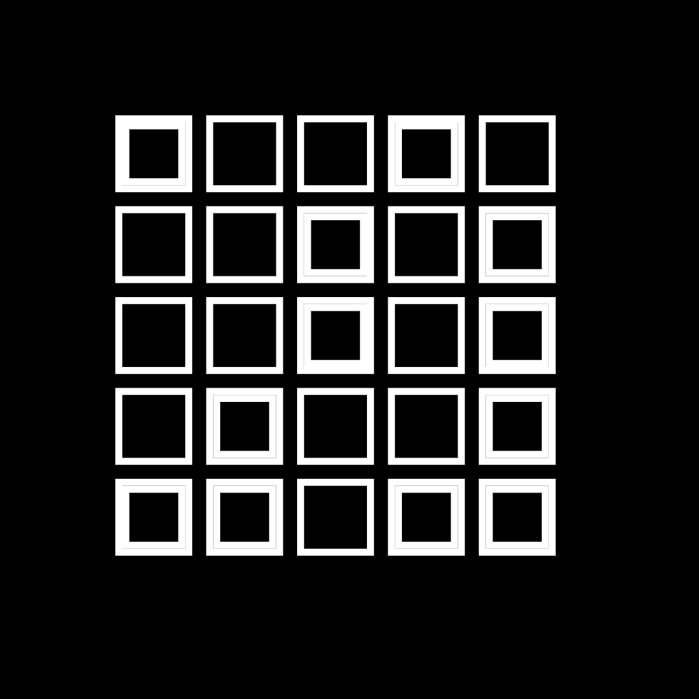
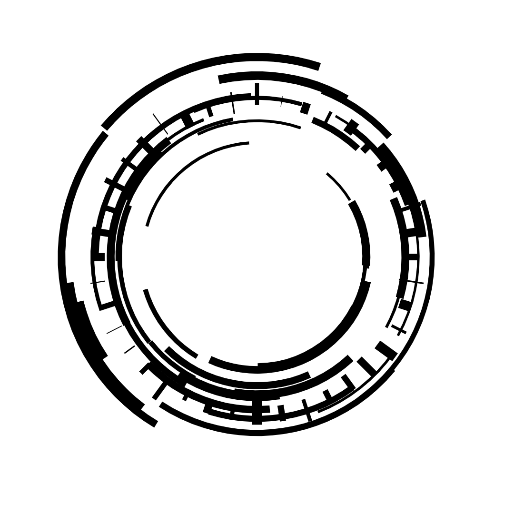
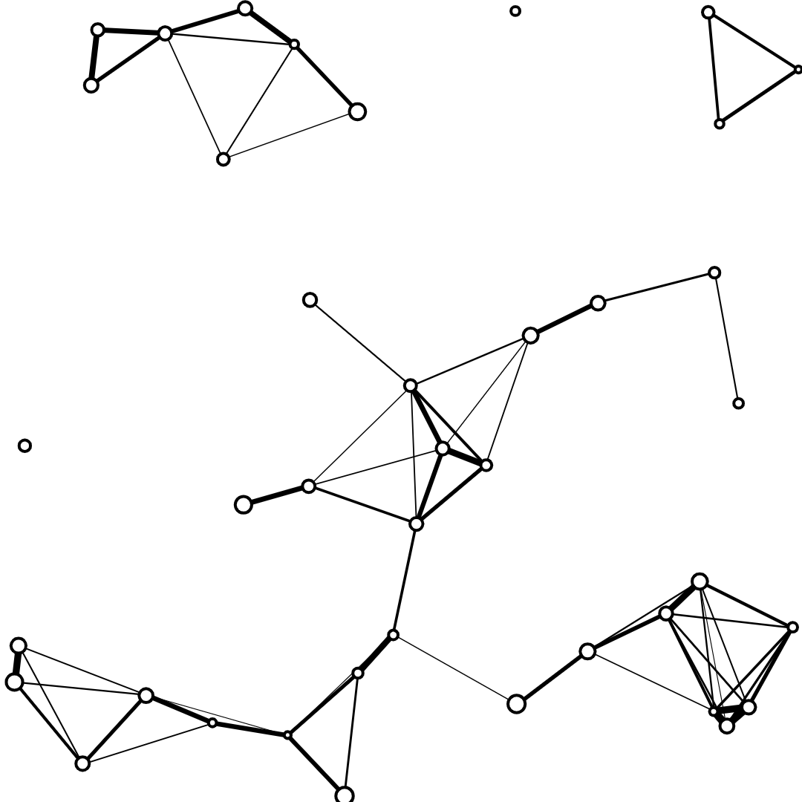
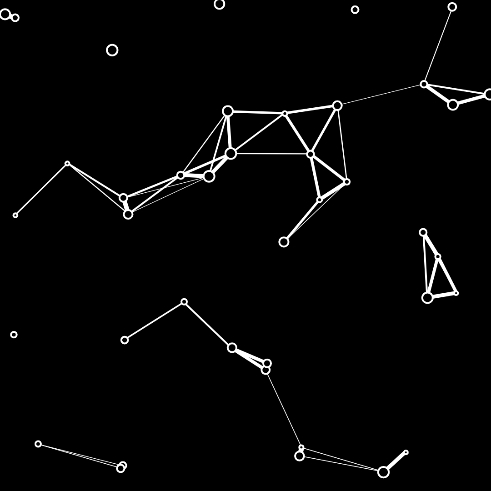
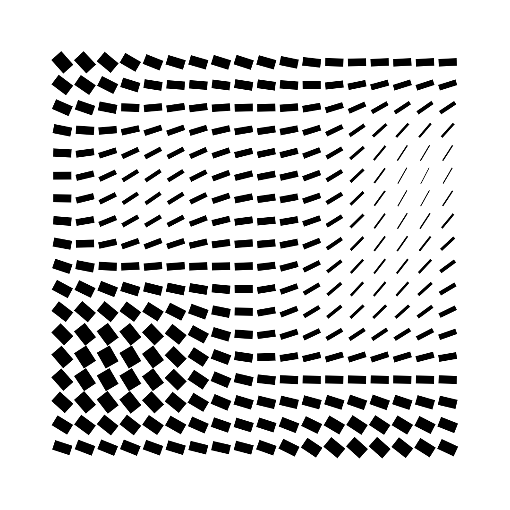
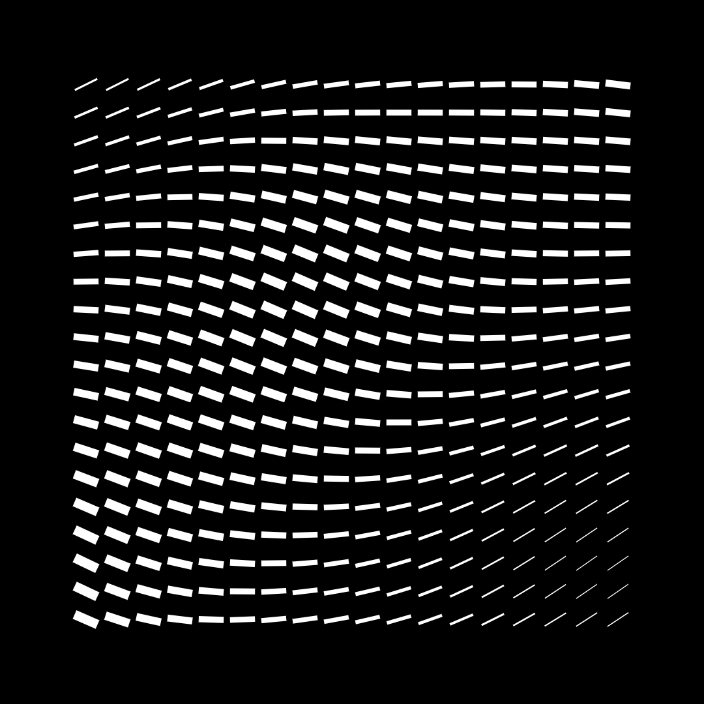
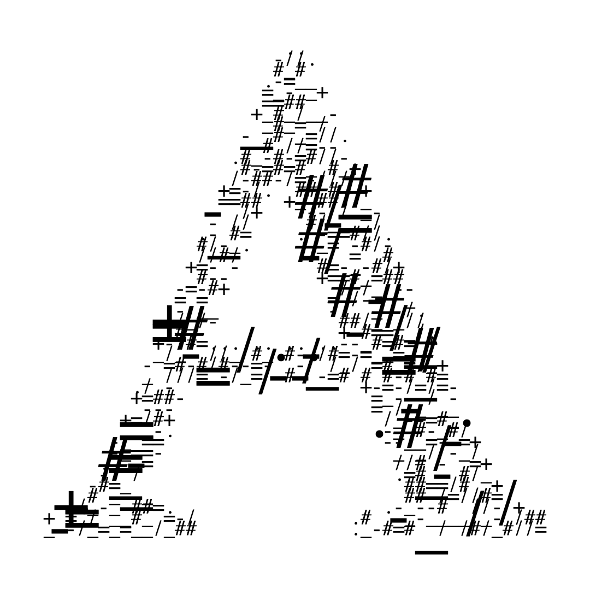

# Creative Coding: Making Visuals with JavaScript

## Sketch 01
[Code](./sketches/sketch-01.js)

  
  

## Sketch 02
[Code](./sketches/sketch-02.js)

  
  

## Sketch 03
[Code](./sketches/sketch-03.js)

  
  

## Sketch 04
[Code](./sketches/sketch-04.js)

  
  

## Sketch 05
[Code](./sketches/sketch-05.js)

  
  

