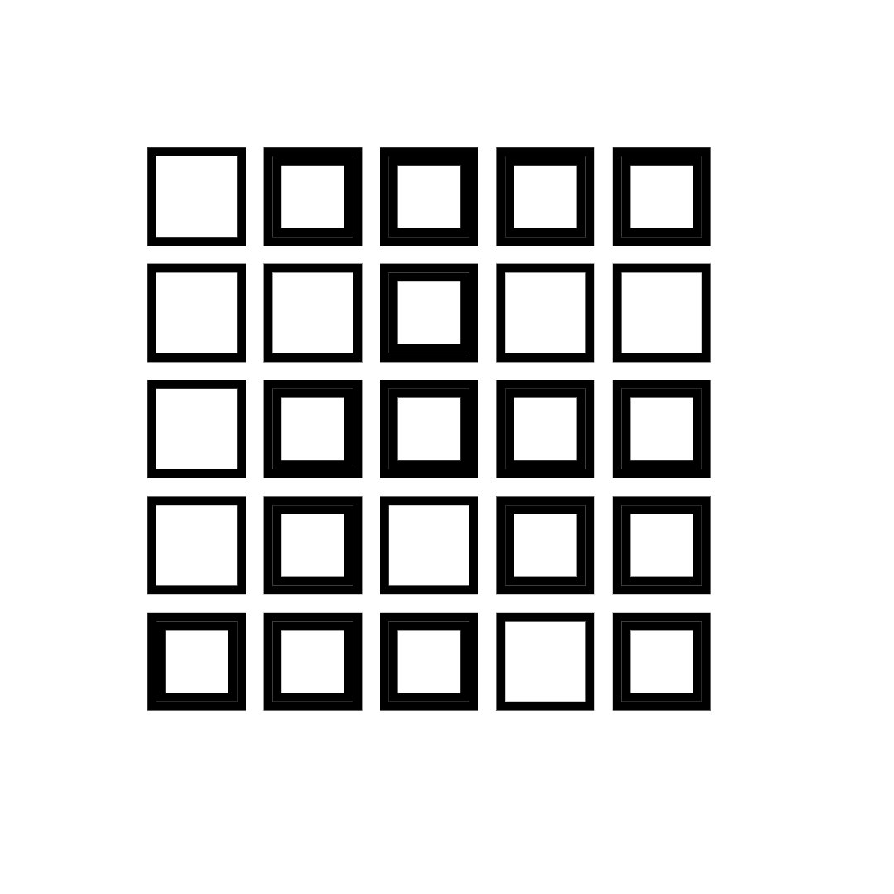

# Creative Coding: Making Visuals with JavaScript
My projects for the [Creative Coding course](https://www.domestika.org/en/courses/2729-creative-coding-making-visuals-with-javascript) from Domestika.

## Sketch 01
[Code](./sketches/sketch-01.js)

  
  

